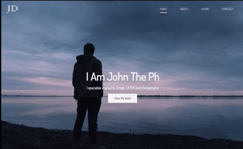

## Running and launching

To build the site run `npm install`, `npm run sass-once` and `npm run copy`. The site's base directory is /dist. I used live server in VSCode to run and test. As of writing this (1/1/2021), this site is live at https://quizzical-leavitt-48e17c.netlify.app/ - check it out!

# John Doe's portfolio!

## Preface

This is the final project I completed for udemy.com's '[Modern HTML & CSS From The Beginning (Including Sass)](https://www.udemy.com/course/modern-html-css-from-the-beginning/)' program.

I wrote most of the HTML and all of the styles used in this site. I used a working version of this site for reference but I created it without referencing its source code.

The javascript on the showcase that cycles the "I Am John The [blah]" was provided; I didn't write that. The images and font-stack was also provided.

## Note on quality

If any potential employers are looking at this project: please note that this isn't a production ready app. I learned what I wanted to learn making this project and didn't spend more time on it than I needed - that leaves more time for other projects!

This site is responsive but doesn't behave well on small devices in landscape mode. The images are large (in file size) and can take a while to load. Also, the scss could use a refactor to reduce duplication and make it a bit more intuitive.

## The landing page and showcase

The landing page showcase features a full screen image and a direct call to action: "View My Work"!

## Flex and Grid layouts

The site uses both css flex and grid for layout. Some of the page content is inside a max-width container and other content is free to expand to fill the screen

## Subtle animations

There are a few subtle animations on the site:

- The navigation links have a fade in underline
- The social links in the footer have a smooth background fade in
- Some of the icons + images have transitions on hover

## Technical skills

I just thought this css only (no frameworks!) section turned out pretty cool and I wanted to show it off :)

## Fluid + responsive layout

Most of the site is fluid and responsive. I didn't take the time to optimize every screen size / orientation / zoom level but completed enough to prove that I could if I wanted to invest the time.

On larger screens:

On small screens:

